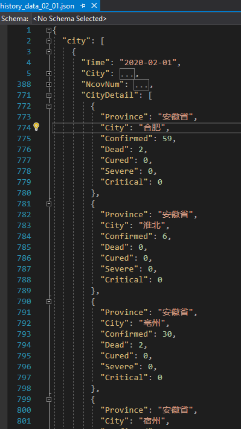
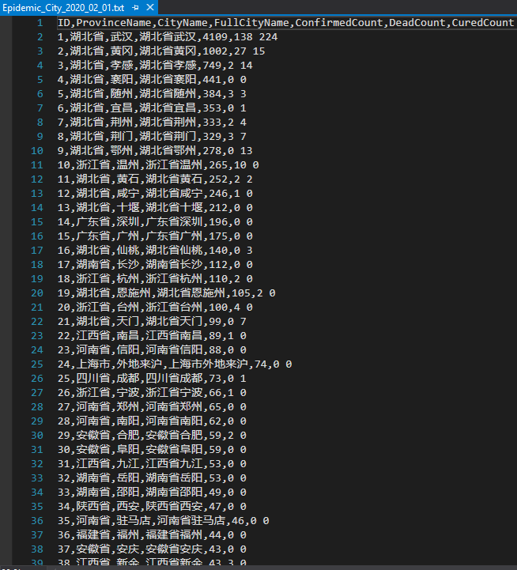

### What it can do

* Convert COVID-19 history Json data to `CSV/Txt` format

### How to use

* Download lastest COVID-19 hisory json file from [here](http://ncov.nosensor.com:8080/api/) , if you want to learn more see this repo [wuhan2020/map-viz](https://github.com/wuhan2020/map-viz)
* Replace `data\history_data_02_01.json` with the download one
* Run project and you will get result in `bin\Debug\netcoreapp2.1`

### Results comparison 

| origin json file  |  csv/txt file |
| --- | --- |
|| |
